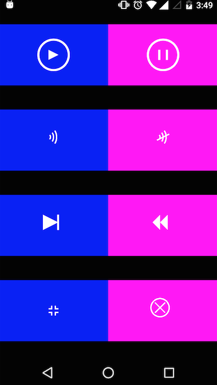

# CanvasMediaControls
This repo contains the controls of Media Player drawn using Canvas(as a Custom View).  

It is often required to use custom controls for Media Player and. One way of using them as storing them as images
and then fetching directly from the `resources` folder. But sometimes, you don't want to unnecessarily add images to
your project for simple things.These controls can be easily drawn on  Canvas and they don't take much resources as well.
As we all know well, even 1 Kb image is dangerous,read [this](http://jebware.com/blog/?p=304)

## Screenshot
&nbsp; &nbsp; &nbsp; &nbsp; &nbsp; &nbsp; &nbsp; &nbsp; &nbsp; &nbsp; &nbsp; &nbsp; &nbsp; &nbsp; &nbsp;
&nbsp; &nbsp; &nbsp; &nbsp; &nbsp; &nbsp; &nbsp; &nbsp;

## How to use it?
Just create an instance of `CustomControlView` and supply it with the required `IconType` along with the size of the view and you are done.
```
CustomControlView playView = new CustomControlView(this, 60, getDensity(), IconType.PLAY_BUTTON);
```
`Density` is required here to adjust the dimensions of the view according to the phone density.
